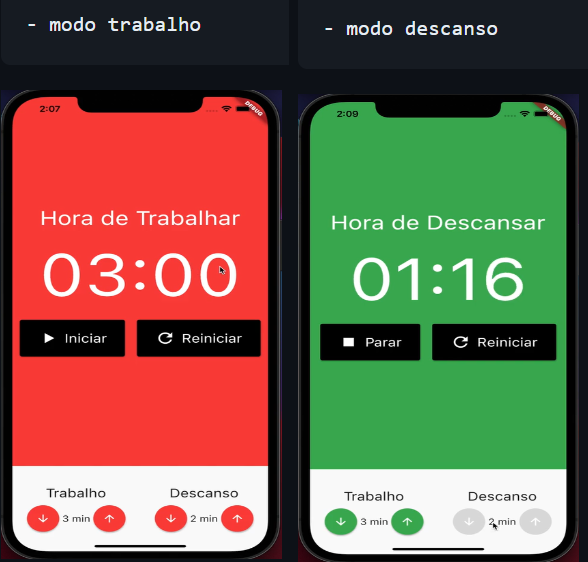
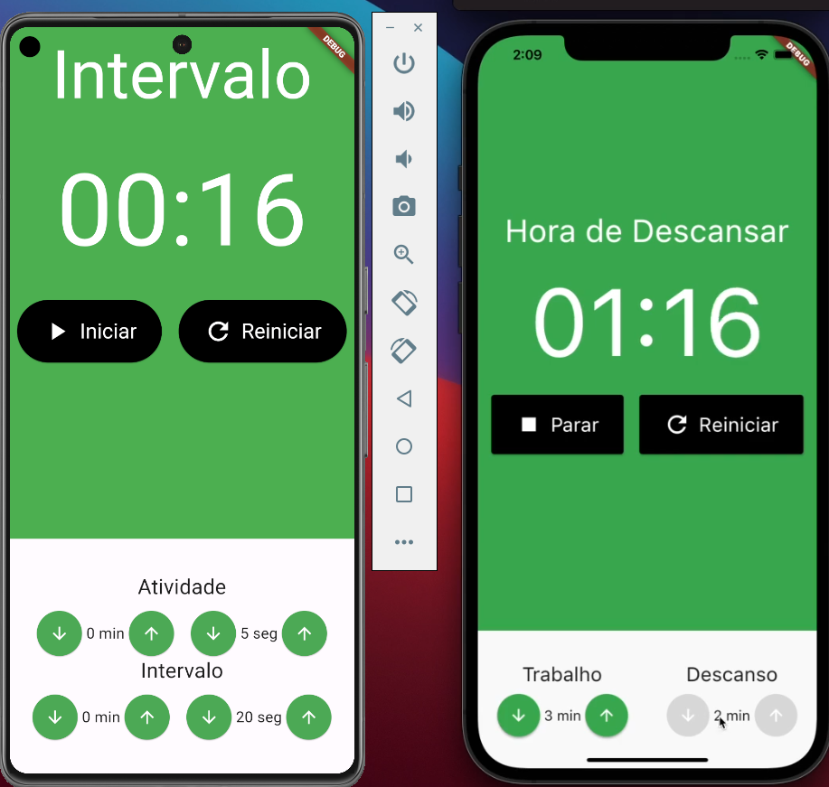

# Pomodoro

   ## Apresentação

   O projeto se trata de um estudo de gerenciamento de estado com "mobx" uma biblioteca com muito demanda no mundo flutter. Aqui podemos ver o conceito de programação reativa, o conceito de observer onde temos o conceito do usuário acionar um evento chamando uma ação onde gera uma mudança em algo observável que gera reações que atualiza sua interface gráfica, Ainda temos o uso do provider temos um sistema muito robusto para trabalhar o estado na aplicação

   A implementação se trata de um relógio "Pomodoro" onde temos pré-definido um período de trabalho e um período de descanso, em minutos, onde podemos configurar esses períodos através de botões apresentados logo abaixo 
 
   

 
   O projeto pode ser encontrado na plataforma do curso COD3R "https://www.cod3r.com.br/" pacote "Aprenda Flutter & Dart e Construa APPs IOs e Android" capitulo "MobX:Desenvolvendo uma Aplicação completa"

   

## Customizações

  Com o sentido de ampliar a utilização do recurso, a implementação foi modificada para que suas configurações de tempo também considerassem os segundos e com isso foi adicionado mais esse widget assim como modificadas suas descrições
   
 
 
